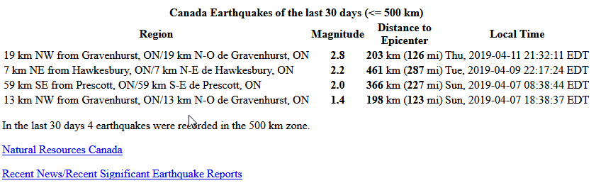
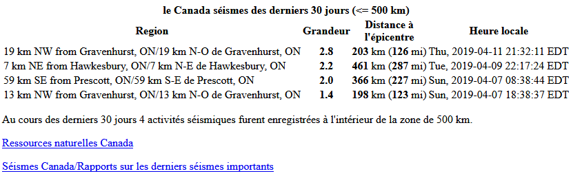

# Earthquakes from Canada NRC (quake-Canada.php)

This script uses data from [Natural Resources Canada](http://www.earthquakescanada.nrcan.gc.ca/recent/maps-cartes/index-en.php) website and returns earthquake activity over the last 30 days. The script provides both English and French display.  XML data is downloaded from the NRC site and cached every 30 minutes.

English output sample:


French output sample:



## Settings

```php
//
  $ourTZ = "America/Toronto";  //NOTE: this *MUST* be set correctly to
// translate UTC times to your LOCAL time for the displays.
//  https://saratoga-weather.org/timezone.txt  has the list of timezone names
//  pick the one that is closest to your location and put in $ourTZ

 $myLat = '43.2';
 $myLong = '-79.25';

 $highRichter = "3.0"; //change color for quakes >= this magnitude
 $distanceKM = 500;   // earthquakes within 500 km

//  pick a format for the time to display ..uncomment one (or make your own)
  $timeFormat = 'D, Y-m-d H:i:s T';  // Fri, 2006-03-31 14:03:22 TZone
//$timeFormat = 'D, Y-M-d H:i:s T';  // Fri, 31-Mar-2006 14:03:22 TZone
//$timeFormat = 'H:i:s T D, d-M-y';  // 14:03:22 TZone Fri, 31-Mar-06
  $cacheFileDir = './';   // default cache file directory
  $cacheName = "quakesCanadaXML.txt";  // used to store the file so we don't have to
  //                          fetch it each time
  $refetchSeconds = 1800;     // refetch every nnnn seconds

  $defaultLang = 'en';  // set to 'fr' for french default language
//                      // set to 'en' for english default language

```

You only need to change $myLat and $myLong to your station's decimal latitude and longitude to see it work in your area.
Defaults are for magnitude 2.0 (or greater) within a 500 km radius.

This script is included in the [Base-Canada Saratoga Template](https://saratoga-weather.org/wxtemplates/index.php) and will auto-customize to
your latitude, longitude, timezone, cacheFileDir and language preferences when loaded in a wx..php page in the template.
